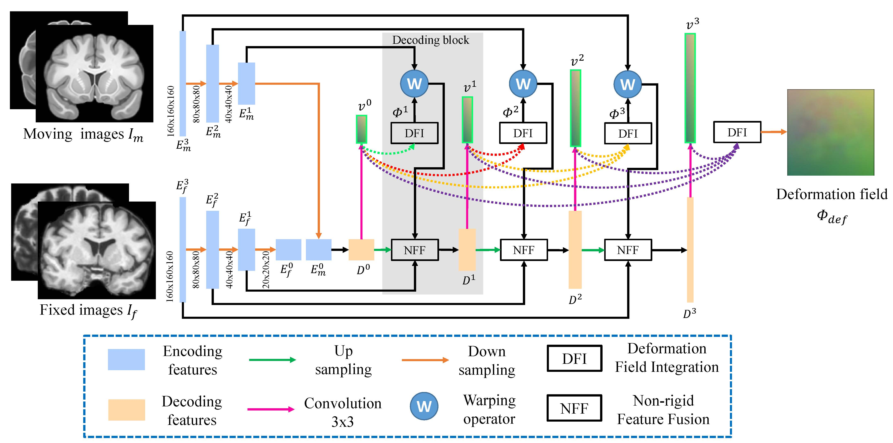

# Progressvie-and-Coarse-to-fine-Registration-Network
The implementation of our paper "Joint Progressive and Coarse-to-fine Registration of Brain MRI via Deformation Field Integration and Non-Rigid Feature Fusion". 

The motivation of this work is to decompose the deformation field in both progressive and coarse-to-fine manner for alleviating the difficulty of prediction. Specifically, we first built a unified CNN which can decompose the deformation filed in a coarse-to-fine manner, and then proposed the DFI and NFF modules for the progressive decomposition relying on light-weight decoding blocks instead of heavy-weight CNN models, i.e. VTN. For more details, please refer to our [paper](https://arxiv.org/abs/2109.12384)


## Install
The packages and their corresponding version we used in this repository are listed in below.

- Tensorflow==1.15.4
- Keras==2.3.1
- tflearn==0.5.0

## Training
After configuring the environment, please use this command to train the model.

```sh
python train.py -g 0 --batch 1 -d datasets/brain.json -b PCNet -n 1 --round 10000 --epoch 10
```

## Testing
Use this command to obtain the testing results.
```sh
python predict.py -g 0 --batch 1 -d datasets/brain.json -c weights/Apr06-1516
```

## Citation
If you use this code as part of any published research, we'd really appreciate it if you could cite the following paper:
```
@article{lv2021joint,
  title={Joint Progressive and Coarse-to-fine Registration of Brain MRI via Deformation Field Integration and Non-Rigid Feature Fusion},
  author={Lv, Jinxin and Wang, Zhiwei and Shi, Hongkuan and Zhang, Haobo and Wang, Sheng and Wang, Yilang and Li, Qiang},
  journal={arXiv preprint arXiv:2109.12384},
  year={2021}
}
```

## Acknowledgment

Some codes are modified from [RCN](https://github.com/microsoft/Recursive-Cascaded-Networks) and [VoxelMorph](https://github.com/voxelmorph/voxelmorph).
Thanks a lot for their great contribution.


